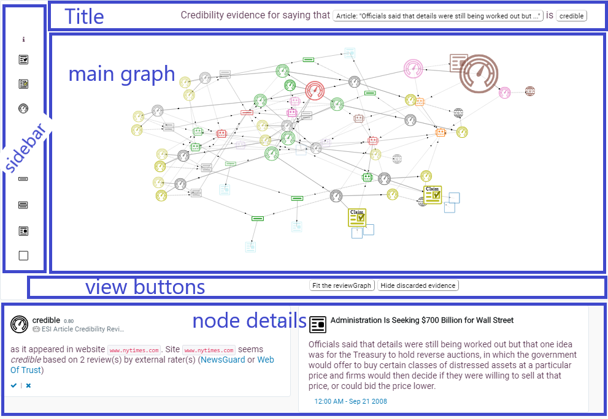

# ReviewGraph component implementation

The reviewGraph component looks as follows:


The component is implemented as follows.
* **model**: at its core, we have an
  [`acred`](https://github.com/rdenaux/acred) `CredibilityReview`
  serialized as a `Graph`. However, there is a lot of additional
  information needed for displaying the graph and managing state and
  events. To keep track of this information we define a
  `UICredReviewGraph`, which serves as our model and drives the
  view. Currently, there are also a sizeable number of properties at
  the `scope` level which are used to coordinate between the various
  subcomponents in the view like the d3js force-graph, the sidebar and
  the selected node details.
* **view**: `src/app/partials/reviewGraph.html`
  * uses an element managed by `src/app/directives/reviewGraphDir.js` which delegates to
    * `src/app/services/rgBuilder.js`
* **controller**: `src/app/controllers/reviewGraph.js` delegates to
  * `src/app/services/rgProcessor.js`

Obviously this follows the MVC pattern for UI components development,
mainly because Banana and Angular already provide that framework and
there's no good reason to deviate from it.


## View
Implemented in [`partials/reviewGraph.html`](../src/app/partials/reviewGraph.html) (of course the dashboard css is used to format the html elements).
The view is relatively simple and defines:
* title `.review-graph-explanation` (sic)
* main graph `.review-graph`
  * sidebar `.review-graph-sidebar`
    * contains buttons with the icons calling `sidebarGraphEvent(nodeType:graphId)`
  * the actual graph `.review-graph-render` rendered by the `reviewGraphDir`ective, which adds:
    * an svg node with a top-level `g` container
      `.review-graph-container` which in turn has subgroups for links
      and nodes
* view buttons `.rg-critical-path-bar`
  * "fit to view" calls `zoomFit()`
  * "show/hide discarded evidence" calls `clickCriticalPath()`
* node details `.ciDocument` (sic)
  * shows different cards depending on current selection
    * given by state flags `activateReviewCard`, `activateItemReviewedCard`, `activateBotCard` or `activateOrganizationCard`
    
### `reviewGraphDir`ective 
This is the **real** controller and does most of the work of:
* inserting the svg element in the view 
* building the svg tree which looks as follows (we list the element type, the class or id and the [D3js selector](https://github.com/d3/d3-selection)):
  * g `.review-graph-container` selector `container`
    * g `#linkGroup_{{graph.id}}` selector `link`
      * polyline instances for each link in the graph
    * g `.nodes` selector `node`
      * g for each node in the graph. With attributes `stroke`, `fill`
        and `id`
        * `use` svg node to re-use svg elements by id. Selector:
          `nodeUse`. We set attributes `xlink:href`, `transform`
          (scale), `style` (opacity).
* defining the [force simulation](https://github.com/d3/d3-force#simulation) to compute a layout and based on [forces](https://github.com/d3/d3-force#forces). Currently we define the following forces:
  * **charge** causing all nodes to repel each other
  * **center** causing the center of gravity to be at a certain point
  * **links** defines preferred distances for specific relation types
  * **positional** assigns preferred positions to certain nodes (currently not really used)
* handling events 
  * selector `nodeUse` on `click`
    * triggers the `selectNode` event for the associated graph node
    * when in hide-discarded mode,
      *  update node's fields `opacityFilter, opacity, neighbhdActivation, enabledNode`
      *  update all d3Selectors.nodeUse `style` attibutes with new `opacity`
      *  update link's fields `opacityFilter, opacity, neighbhdActivation, enabledNode`
      *  update all d3Selectors.link `stroke-opacity` and `marker-mid` attributes
  * `drag` 
* handlers
  * `handleNodeActivation`
    * called when a sidebar button is pressed and when the
      `showDiscardedEvidence` is set to false
  * **TODO** set up a handler to calculate the opacity for a node:
    * a node is hidden when it's `alwaysShow` flag hasn't been set and: 
      * the matching `sideBarNodeType` has `style.opacity != 1` **or**
      * it is a discarded node and not `showDiscardedEvidence`
    * in all other circumstances the node is shown with its `originalOpacity`
    * this means we need to recalculate the node's style when
      * `showDiscardedEvidence` changes
      * a `toggleNodesByType` event occurs (from sidebar)
      * the node's `alwaysShow` flag changes

## Model

### acred Credibility Review Graph
At its core, we have an [acred](https://github.com/rdenaux/acred) [Credibility Review](https://arxiv.org/abs/2008.12742v1), but formatted as a Graph rather than as the usual nested trees. The Graph is just a JSON object with fields:
* `nodes`: a list of individual objects for a wide variety of schema.org compatible data items. The main types are Reviews, CreativeWorks, Person, Bot, Organizations, etc.
* `links`: a list. Each element is an object with fields:
  * `rel` with the name of relation
  * `source`: with a string identifying a node
  * `target`: with a string identifying a node
* `mainNode`: a string identifying the node that is the main
  `CredibilityReview`, all the other nodes are essentially
  evidence/context needed to better understand this node.
* `@context` is always `http://coinform.eu`
* `@type` is always Graph

### UICredReviewGraph
The main point of the reviewGraph component is to display this graph and help users to explore it and perform tasks. For display purposes and managing state (e.g. hiding/showing nodes), we need to keep track of additional information. Therefore, we extend the `acred` `Graph` into a, newly defined, `UICredReviewGraph`. It extends:
* the graph with properties:
  * `id`, same as the `mainNode`
  * `mainItemReviewed`: actually a calculated label for the
    `mainNode.itemReviewed`, typically an Article, Tweet or Sentnece.
  * `mainNodeLabel` the credibility of the document?
  * `maxHLevel`: int of the maximum `hierarchyLevel` over all nodes in
    the graph
  * nodes and links are copied and extended as described below.
* for nodes the following properties are added:
  * `id`: either the identifier, '@id' of 'url' value
  * `hierarchyLevel`: int with depth from the mainNode 
  * `group`: int based on the nodeType (e.g. Review, Bot, Thing)
  * `nodeSize`: deprecated, useful only if using svg circle
  * `nodeScale`: used to transform the standard size of the svg element
  * `enabledNode`: bool by default true, set to false for all discarded nodes, opposite of `hidden`?
  * `isDiscardedEvidence`: bool is true when the node is not one of
    the *critical nodes* in the `isBasedOnKept` closure (+ neighbouring nodes).
* for links:
  * `value`: float, currently fixed value
* for both nodes and links:
  * `hidden` (was `opacityFilter`): bool true when the node should be hidden (ie when not `showDiscardedEvidence`)
  * `opacity`: float in [0,1], defaults to the same as `originalOpacity`, but may change as nodes are hiddent for a variety of reasons (e.g. hide types of nodes or hide discarded nodes)
  * `originalOpacity`: default opacity assigned to the node/link  //FIXME: we should be able to calculate opacity based on some global state, instead of introducing state here
  * `neighbhdActivation` bool ?? true if node was hidden, but got activated via a neighbouring node

### Other State
At the moment all other state is stored in the angular `scope`, but not declared in the controller. Most is declared/introduced in the directive:
* `wholeGraph` points to the UICredReviewGraph
* `selectedNode` points to a node in the graph. At the moment we have
  a very simple selection model, just a single node can be selected at
  a time.
* related to discarded evidence in the graph:
  * `showDiscardedEvidence` (was `manageCriticalPath` **and**
    `prunedGraphActivation`): boolean when true, the discarded
    evidence (nodes and links) should be shown in the UI.
  * `criticalPathButtonText`: str label for the button
* related to the sidebar:
  * `sideBarNodeTypes` with fields:
    * `id` the high-level node type, aligned with `nodeMapper.calcSymbol`
    * `description`: a short description of the node type
    * 
* related to selected node details:
  * `activateBotCard`: 
  * `activateOrganizationCard`
  * `activateReviewCard`
  * org card
    * `organizationName`
    * `organizationUrl`
    * `organizationIconType`
  * bot card
    * `botName`
    * `botUrl`
    * `botDescription`
    * `botDateCreated`
    * `botIconType`
  * itemReviewed card
    * `pubDate`
    * `viewableContent`
    * `itRevTitle`
    * `itRevUrl`
    * `itRevDomain`
    * `itRevCardIconType`
  * review card
    * `credibilitylabel`
    * `credLabelDescription`
    * `reviewConfidence`
    * `credibilityAssessor`
    * `revExplanation`
    * `revCardIconType`


Event handlers on `scope`:
* related to node details (cards)
  * `rateReviewAsAccurate`
  * `rateReviewAsInaccurate`
* related to the sidebar:
  * `sidbarGraphEvent`
* related to the title
  * `displayMainReview`
  * `displayMainItemReviewed`
* related to the view buttons
  * `toggleShowDiscarded` (was `clickCriticalPath`) 
  * `zoomFit`

## Controller
Implemented in `src/app/controllers/reviewGraph.js` 
It should be called as follows in some calling html template (see e.g. the `src/app/panels/table/module.html`):

``` html
<div ng-controller='reviewGraph' ng-init="init(ciDoc)" ng-include="'app/partials/reviewGraph.html'"></div>
```
where `ciDoc` is a co-inform document. The controller fetches an `acred` credibility review graph if one is available for the document. It then delegates to:

* the `rgProcessor` to enrich the `acred` graph so that nodes and
  links are compatible with the D3js force-graph library. The
  processed graph is stored in `$scope.wholeGraph`.
* angular to render the html template using the new
  `$scope.wholeGraph` state. As part of the rendering, the `reviewGraphDir`ective actually builds the
  D3js force graph and handles events.

### Service `rgProcessor`
1. Converts the acred credibility review Graph into a
   `UICredReviewGraph` which is compatible with D3js
   force-graphs. Both graphs contain nodes and links, but the
   enriching process adds fields relevant for displaying the graph and
   managing state and UI events. See the [model section](#Model).
2. provides common extractor functions to access and calculate
   information about nodes and links in the graph (both the original
   acred Graph as well as for the `UICredReviewGraph`). These are
   available via the `search`, `nodeMapper` and `linkMapper`
   properties.


